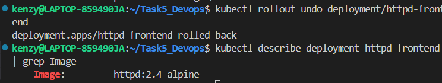

# Part 1

## Q1: Create pod nginx with name `mynginx` directly from command (no YAML file)
###  Explanation
We can run a pod using `kubectl run`, specifying both the pod name and the image.
###  Command Used
```bash
kubectl run mynginx --image=nginx 
```
###  Command Output
pod/mynginx created
###   Terminal Screenshot: 
   
  

## Q2: create pod nginx with name `my nginx` command and use Image nginx123  direct from command don't use yaml file

###  Explanation 
nginx123 doesn’t exist → pod will fail.
### Command Used
```bash
kubectl run mynginx2 --image=nginx123
```
### Command Output
pod/mynginx2 created
### Terminal Screenshoot


## Q3: check the status and why it doesn't work 
###  Explanation 
nginx124 doesn't exit so pod will fail to pull this image and faol

### Command Used
``` bash 
kubectl describe pod mynginx2
```
### Terminal ScreenShot


## Q4: I need to know node name - IP - Image Of the POD
### Explanation:
we will get the node name ,IP and image of the pod Failed Pod
### Commands Used:
```bash
kubectl describe pod mynginx2 ## this to get the node name, IP and Image of the failed pod
```
``` bash 
kubectl get pod mynginx2 -o wide ## this is to get the node name& IP of failed pod
```
 
### Command Output:
output: it will give the node name its IP address and the Image 
### Terminal Screenshot:
IP,Node name and image
 
IP and node name  
 

## Q5: delete the pod 
### Explanation
To remove a pod from the cluster, we use the kubectl delete pod command followed by the pod’s name. Once deleted, the pod will no longer appear in the list of active pods.
### Command Used
``` bash 
kubectl delete pod mynginx2
```
### Command Output
pod "mynginx2" deleted
### Terminal Screenshot

in order to verify 


## Q6:  Create another pod with YAML file and use label
### Explanation
We use a YAML manifest to define a Pod and attach labels for identification.

### 📄 YAML File
```yaml
apiVersion: v1
kind: Pod
metadata:
  name: nginx-pod
  labels:
    app: nginx
spec:
  containers:
  - name: nginx
    image: nginx:latest
```
### Command Used
```bash
kubectl apply -f yamls/nginx-pod.yaml
```
### Command Output
pod/nginx-pod created
### Terminal Screenshot


## Q7: create Riplicaset with 3 replicas using nginx Image 

### Explanation 
ReplicaSet ensures a fixed number of pod replicas are running.
### 📄 YAML File
``` yaml
 apiVersion: apps/v1
kind: ReplicaSet
metadata:
  name: nginx-rs
spec:
  replicas: 3
  selector:
    matchLabels:
      app: nginx
  template:
    metadata:
      labels:
        app: nginx
    spec:
      containers:
      - name: nginx
        image: nginx
```

### Command Used
``` bash 
kubectl apply -f yamls/replicaset.yaml
```
``` bash 
kubectl get rs ## in order to view the pods
```
### Terminal Screenshot 


## Q8: scale the replicas to 5 without edit in the Yaml file

### Explanation
We use the scale command to increase replicas.

### Command Used
``` bash 
kubectl scale rs nginx-rs --replicas=5 ## this to set the replicas to 5
```
``` bash 
kubectl get pods -l app=nginx ## this to show the pods
```
### Terminal Output


## Q9: Delete any one of the 5 pods and check what happen and explain 

## Explanation 
ReplicaSet detects fewer replicas and automatically creates a new pod to match the desired state.

## Command Used
``` bash 
kubectl delete pod nginx-rs-82bms ## this to delete the pod
```
``` bash 
kubectl get pods -l app=nginx ## this to show new pod created
```
### Terminal Screenshot


## Q10: Scale down to 2 pods without scale command
### Explanation 
We edit the ReplicaSet live using kubectl edit.

## Command Used 
``` bash 
kubectl edit rs nginx-rs ## then i edited inside it to be 2
```
### Terminal Screenshot


## Q11:  find out the issue in the below Yaml (don't use AI)
```yaml
## this is the code with issue
apiVersion: apps/v1
kind: ReplicaSet
metadata:
  name: replicaset-2
spec:
  replicas: 2
  selector:
    matchLabels:
      tier: frontend
  template:
    metadata:
      labels:
        tier: nginx
    spec:
      containers:
      - name: nginx
        image: nginx
```
## Error in code 
The issue is label mismatch:

Selector: tier=frontend

Template: tier=nginx

## Corrected file
```yaml
apiVersion: apps/v1
kind: ReplicaSet
metadata:
  name: replicaset-2
spec:
  replicas: 2
  selector:
    matchLabels:
      tier: nginx ### both have the same name
  template:
    metadata:
      labels:
        tier: nginx ### both have the same name
    spec:
      containers:
      - name: nginx
        image: nginx
```
## Q12: find out the issue in the below Yaml (don't use AI)
``` yaml
## Code with error
apiVersion: apps/v1
kind: deployment
metadata:
  name: deployment-1
spec:
  replicas: 2
  selector:
    matchLabels:
      name: busybox-pod
  template:
    metadata:
      labels:
        name: busybox-pod
    spec:
      containers:
      - name: busybox-container
        image: busybox
        command:
        - sh
        - "-c"
        - echo Hello Kubernetes! && sleep 3600
```
### Error in Code
kind is case sensitive so it have to be capital 
Deployment not deployment

### Corrected Code:
``` yaml 
apiVersion: apps/v1
kind: Deployment
metadata:
  name: deployment-1
spec:
  replicas: 2
  selector:
    matchLabels:
      name: busybox-pod
  template:
    metadata:
      labels:
        name: busybox-pod
    spec:
      containers:
      - name: busybox-container
        image: busybox
        command:
        - sh
        - "-c"
        - echo Hello Kubernetes! && sleep 3600
```
## Q13: find out the issue in the below Yaml (don't use AI)

``` yaml 
apiVersion: v1
kind: Deployment
metadata:
  name: deployment-1
spec:
  replicas: 2
  selector:
    matchLabels:
      name: busybox-pod
  template:
    metadata:
      labels:
        name: busybox-pod
    spec:
      containers:
      - name: busybox-container
        image: busybox
        command:
        - sh
        - "-c"
        - echo Hello Kubernetes! && sleep 3600
``` 
### Error in code
there is resource mapping error so no kind Deployment in version v1 it has to be apps/v1

### Corrected Code:
``` yaml 
apiVersion: apps/v1
kind: Deployment
metadata:
  name: deployment-1
spec:
  replicas: 2
  selector:
    matchLabels:
      name: busybox-pod
  template:
    metadata:
      labels:
        name: busybox-pod
    spec:
      containers:
      - name: busybox-container
        image: busybox
        command:
        - sh
        - "-c"
        - echo Hello Kubernetes! && sleep 3600
```

## Q14: what's command you use to know what Image name that running the deployment 

### Explanation: 
To check which container image is being used by a Deployment, we can extract the image field from the Deployment’s pod template. This ensures we see the exact image that the pods will run
### Commands Used:

First Option
``` bash 
kubectl get deployment deployment-1 -o jsonpath='{.spec.template.spec.containers[*].image}'
```
Second Option
``` bash 
kubectl describe deployment deployment-1
``` 

### Terminal ScreenShot

First Option Screenshot 


Second Option Screenshot


## Q15: create deployment using following data : Name: httpd-frontend;Replicas: 3; Image: httpd:2.4-alpine

### Explanation 
We need to create a Deployment object in Kubernetes that manages 3 replicas (pods), each running the container image httpd:2.4-alpine. This ensures high availability of the HTTP server

### 📄 Yaml File 
``` yaml 
apiVersion: apps/v1
kind: Deployment
metadata:
  name: httpd-frontend
spec:
  replicas: 3
  selector:
    matchLabels:
      app: httpd-frontend
  template:
    metadata:
      labels:
        app: httpd-frontend
    spec:
      containers:
      - name: httpd
        image: httpd:2.4-alpine
        ports:
        - containerPort: 80
``` 
### Command used 
``` bash 
kubectl apply -f yamls/deployment.yaml
```
``` bash 
kubectl get pods -l app=httpd-frontend
```
### Terminal Screenshot 


## Q16: replace the image to nginx777 with command directly
### Explanation 
Instead of editing the YAML file, we can use the kubectl set image command to update the container image of a deployment.

### Command Used 
``` bash 
kubectl set image deployment/httpd-frontend httpd=nginx777
```

### Terminal Screenshot


## Q17: rollback to pervious version
### Explanation:
Kubernetes allows rolling back the deployment to the previous working revision using the kubectl rollout undo command.

### Command used 
``` bash 
kubectl rollout undo deployment/httpd-frontend
``` 
```bash 
kubectl describe deployment httpd-frontend | grep Image ## in order to display the image
```
### Terminal Screenshot:


## Q18: Create a Simple Web Application:   
## * Use a Dockerfile to create a simple web application (e.g., an Nginx server serving an HTML page).
## * Build the Docker image and push it to DockerHub your private Account.

### Explanation: 
 We will:

Create a simple HTML page.

Write a Dockerfile that uses nginx as the base image and serves this HTML page.

Build a Docker image.

Tag the image with my DockerHub username.

Push the image to my private DockerHub repository.
### Commands Used:
``` bash
mkdir simple-web && cd simple-web
echo "<h1>Hello from my Simple Web App</h1>">index.html
cat <<EOF > Dockerfile ## this is to create the docker file
FROM nginx:latest
COPY index.html /usr/share/nginx/html/index.html
EXPOSE 80
EOF
docker build -t simple-web:1.0 .
docker login -u kenzytamer ## in order to login Dockerhub account
docker tag simple-web:1.0 kenzytamer/simple-web:1.0 ## taking the docker image
docker push kenzytamer/simple-web:1.0 ## Pushing the image to repository on my account
```


## Q19- Create a Deployment Using This Image: Deploy the Docker image from DockerHub to Kubernetes with a Deployment that has 3 replicas.
### Explanation:
We are deploying the Docker image kenzytamer/simple-web:1.0 from DockerHub into Kubernetes.
### YAML File- simple-web_deploy.yaml
```yaml
apiVersion: apps/v1
kind: Deployment
metadata:
  name: simple-web-deployment
  labels:
    app: simple-web
spec:
  replicas: 3
  selector:
    matchLabels:
      app: simple-web
  template:
    metadata:
      labels:
        app: simple-web
    spec:
      containers:
      - name: simple-web
        image: kenzytamer/simple-web:1.0
        ports:
        - containerPort: 80
```
## Commands Used:
``` bash 
kubectl apply -f yamls/simple-web_deploy.yaml
```
``` bash 
kubectl get pods -l app=simple-web
```

## Terminal Screenshot


## Q20: Expose the Frontend (FE) Using Service to make it accessible from your browser.

### Explanation:
After deploying the frontend with 3 replicas, we need to expose it so users can access it from their browser.
We do this by creating a Service:

Type: NodePort → Makes the app accessible from outside the cluster 
The Service will route traffic to the Deployment pods (on port 80).
Kubernetes automatically load balances across all 3 replicas.

### YAML FILE:
``` yaml 
apiVersion: v1
kind: Service
metadata:
  name: simple-web-service
spec:
  selector:
    app: simple-web
  ports:
    - protocol: TCP
      port: 80
      targetPort: 80
      nodePort: 30080
  type: NodePort
```

### Commands used
``` bash 
kubectl apply -f yamls/service.yaml
```
```bash 
kubectl get svc ## to check it is a node port
```

``` bash 
minikube service simple-web-service ## to open in broswer
```

### Terminal ScreenShots


## Q21:Create a Backend (BE) Deployment: Create another Deployment for the backend using the following data: Image: python:3.8-slim Command: ["python", "-m", "http.server", "8080"] (include this command in the deployment file).

### Explaination:
We are going to create a Deployment for the backend with the following requirements:

Image: python:3.8-slim

Command: ["python", "-m", "http.server", "8080"] → This will run a simple HTTP server on port 8080 inside the container.
Replicas: We’ll use 3 replicas.
The Pod will listen on port 8080, so we must declare that in the containerPort.

### YAML FILE:
``` yaml 
apiVersion: apps/v1
kind: Deployment
metadata:
  name: backend-deployment
  labels:
    app: backend
spec:
  replicas: 3
  selector:
    matchLabels:
      app: backend
  template:
    metadata:
      labels:
        app: backend
    spec:
      containers:
        - name: backend-container
          image: python:3.8-slim
          command: ["python", "-m", "http.server", "8080"]
          ports:
            - containerPort: 8080
```
### Commands used 
``` bash 
kubectl apply -f yamls/service-deployment.yaml
```
```bash 
kubectl get pods -l app=backend
```
### Terminal Screenshot


## Q22: Expose the Backend Internally Using Service: Use kubectl command to make it accessible from your browser (without NodePort)

### Explanation:
We will expose the backend deployment on port 8080 using a ClusterIP service.

ClusterIP makes the backend accessible only inside the cluster, not from your local machine’s browser.

The frontend can communicate with the backend through this internal service.

You cannot access it via localhost:8080, instead, it’s accessible by its service name (backend-service) from within the cluster.

### YAML FILE:
``` yaml 
apiVersion: v1
kind: Service
metadata:
  name: backend-service
spec:
  selector:
    app: backend
  ports:
    - protocol: TCP
      port: 8080      # service port
      targetPort: 8080 # container port
  type: ClusterIP
```
### Commands Used:
``` bash 
kubectl apply -f yamls/backend-service.yaml
kubectl get svc
```
### Terminal Screenshot


## Q23:Create a LoadBalancer Service: 
# Create a LoadBalancer service for your frontend. 
# Explain what happens when you try to apply it in an environment that does not support load balancers (e.g., Minikube).

### Explanation:
A LoadBalancer Service exposes your application to the internet by provisioning a cloud provider’s load balancer (e.g., AWS ELB, GCP LoadBalancer).

When you apply this in Minikube or any local Kubernetes cluster that does not support external load balancers, the service will be created, but it won’t get an external IP. Instead, it will remain in the pending state for EXTERNAL-IP.

### YAML File:
``` yaml 
apiVersion: v1
kind: Service
metadata:
  name: frontend-loadbalancer
spec:
  selector:
    app: frontend
  ports:
    - protocol: TCP
      port: 80
      targetPort: 80
  type: LoadBalancer
```
### Commands Used:
``` bash
kubectl apply -f yamls/frontend-loadbalancer.yaml
kubectl get svc
```
### Terminal ScreenShot
frontend-loadbalancer External IP is "Pending"


## Q24: Explain DaemonSet and Provide a YAML File:
* Explain what a DaemonSet is and how it works.
* Provide a YAML file to create a DaemonSet in Kubernetes.

### Explanation:
A DaemonSet ensures that a copy of a Pod runs on all (or some) nodes in the cluster.

Common use cases:

Running monitoring agents

Running logging agents 

Running network plugins 

When new nodes are added to the cluster, DaemonSet automatically schedules Pods on them.

If nodes are removed, the DaemonSet’s Pods on those nodes are also deleted.

Unlike a Deployment, which balances Pods across nodes, a DaemonSet guarantees one Pod per node

### YAML FILE:
``` yaml 
apiVersion: apps/v1
kind: DaemonSet
metadata:
  name: log-collector
  namespace: kube-system
spec:
  selector:
    matchLabels:
      app: log-collector
  template:
    metadata:
      labels:
        app: log-collector
    spec:
      containers:
      - name: log-collector
        image: busybox:1.28
        args:
        - /bin/sh
        - -c
        - "while true; do echo 'Collecting logs from $(hostname)'; sleep 30; done"
```
## Q25:List the Components of the ** Master node ** and what is the purpose of each component 

* API Server (kube-apiserver)
Purpose: Acts as the entry point to the Kubernetes cluster.

Handles all REST requests (from kubectl, UI, or other components).

Validates and processes API objects like Pods, Services, ConfigMaps, etc.

It is the "front door" of the cluster.

* etcd

Purpose: A key-value store that stores all cluster data (desired state, config, secrets, etc.).

Acts as the single source of truth for the cluster state.

Highly available and consistent.

* Controller Manager (kube-controller-manager)

Purpose: Runs various controllers that ensure the cluster state matches the desired state.

Examples of controllers:

Node Controller → handles node failures.

Replication Controller → ensures correct number of pods.

Endpoints Controller → updates Service endpoints.

Service Account & Token Controller → manages access.

* Scheduler (kube-scheduler)
Purpose: Decides on which node a new Pod should run.

Considers resource requirements (CPU, memory), policies, affinity/anti-affinity rules, taints, and tolerations.

It does not run pods itself, but assigns pods to nodes.

## Q26: List  the Components of the ** Worker node ** and what is the purpose of each component

* kubelet

Purpose:

An agent that runs on every worker node.

Ensures that the containers described in the PodSpec are running.

Communicates with the Kubernetes API Server on the Master node.

Performs health checks on Pods and reports back to the control plane.

* kube-proxy

Purpose:

Maintains network rules on nodes.

Forwards traffic to the correct Pod across nodes.

Implements Service abstraction for Pods, handling load balancing and networking (ClusterIP, NodePort, etc.).

* Container Runtime (e.g., Docker, containerd, CRI-O)

Purpose:

Responsible for running the actual containers.

Pulls container images from registries.

Provides isolation for container processes.

Interacts with kubelet to start/stop containers.

* Pods (Application Containers)

Purpose:

Smallest deployable unit in Kubernetes.

Encapsulates one or more containers, storage, and networking.

Represents the actual application workload running on the worker node.